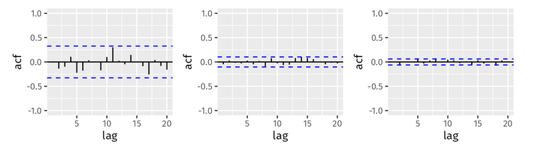

```{r}
#| label: setup
#| include: false

# Load required libraries
library(tidyverse)
library(fpp3)
library(knitr)

# Set default chunk options
knitr::opts_chunk$set(
  fig.width = 8,
  fig.height = 6,
  fig.align = "center",
  out.width = "80%"
)

# Set ggplot theme
theme_set(theme_minimal())
```

# Homework 6

## 9.1

### a. Differences among figures and white noise indication
Explain the differences among these figures. Do they all indicate that the data are white noise?

The difference between these figures is the number of observations used to calculate the autocorrelations. As the number of observations increases, the autocorrelations become more stable and closer to zero, which is characteristic of white noise. All three figures indicate that the data are white noise, as the autocorrelations are close to zero and fall within the confidence interval for random correlation.

figure


### b. Critical values and autocorrelations variation
Why are the critical values at different distances from the mean of zero? Why are the autocorrelations different in each figure when they each refer to white noise?

Due to the law of large numbers, the more observations you have, the more confident you can be that your sample is representative of the population. Therefore, the critical values are closer to zero with more observations. Thus, we can get a tighter confidence interval with larger observations.

## 9.2

A classic example of a non-stationary series are stock prices. Plot the daily closing prices for Amazon stock (contained in gafa_stock), along with the ACF and PACF. Explain how each plot shows that the series is non-stationary and should be differenced.


```{r}
amzn <- gafa_stock %>%
  filter(Symbol == "AMZN")

amzn |> 
  autoplot(Close) +
  labs(title = "Daily Closing Prices for Amazon Stock",
       y = "Closing Price (USD)",
       x = "Date")

amzn %>%
  ACF(Close) |> 
  autoplot() +
  labs(title="Amazon Stock ACF")

amzn |> 
  PACF(Close) |>
  autoplot() +
  labs(title="Amazon Stock PACF")

amzn |> 
  mutate(Close = difference(Close)) |>
  autoplot(Close) +
  labs(title = "Differenced Daily Closing Prices for Amazon Stock")
```

The key observation from these plots is that the ACF and PACF both have observations outside of statistical randomness. In terms of the ACF, this means that the closing price is very highly correlated with past values. The PACF will remove the correlation of effects of prior observations (hence the large initial spike followed by smaller, oscillating peaks) and only consider the $t$ and $t-1$ observation,  but we still see significant correlation.

This series also is non-stationary. The series shows a very obvious trend upwards, which clearly indicates that this level is not stationary. To difference, we will want to remove this trend. With a single difference, we've eliminated the trend and are left with a stationary series.

## 9.3

For the following series, find an appropriate Box-Cox transformation and order of differencing in order to obtain stationary data.

### a. Turkish GDP
Turkish GDP from global_economy.

```{r}
turkey_gdp <- global_economy %>%
  filter(Country == "Turkey") %>%
  select(Year, GDP)

autoplot(turkey_gdp, GDP) +
  labs(title = "Turkish GDP",
       y = "GDP (USD)",
       x = "Year")

lambda <- turkey_gdp %>%
  features(GDP, features = guerrero) %>%
  pull(lambda_guerrero)

turkey_gdp_transformed <- turkey_gdp
turkey_gdp_transformed <- turkey_gdp_transformed %>%
  mutate(GDP = box_cox(GDP, lambda))
autoplot(turkey_gdp_transformed, GDP) +
  labs(title = "Transformed Turkish GDP",
       y = "Transformed GDP",
       x = "Year")

turkey_gdp_transformed %>%
  mutate(GDP = difference(GDP)) %>%
  autoplot(GDP) +
  labs(title = "Differenced Transformed Turkish GDP",
       y = "Differenced Transformed GDP",
       x = "Year")
```

```{r}
# ACF
turkey_gdp_transformed %>%
  mutate(GDP = difference(GDP)) %>%
  ACF(GDP) |> 
  autoplot() +
  labs(title="Turkish GDP ACF After Differencing")
```


### b. Accommodation takings in Tasmania
Accommodation takings in the state of Tasmania from aus_accommodation.

```{r}
tas_accommodation <- aus_accommodation %>%
  filter(State == "Tasmania") %>%
  select(Date, Takings)

autoplot(tas_accommodation, Takings) +
  labs(title = "Accommodation Takings in Tasmania",
       y = "Takings (AUD)",
       x = "Month")

lambda <- tas_accommodation %>%
  features(Takings, features = guerrero) %>%
  pull(lambda_guerrero)

tas_accommodation_transformed <- tas_accommodation
tas_accommodation_transformed <- tas_accommodation_transformed %>%
  mutate(Takings = box_cox(Takings, lambda))
autoplot(tas_accommodation_transformed, Takings) +
  labs(title = "Transformed Accommodation Takings in Tasmania",
       y = "Transformed Takings",
       x = "Month")

tas_accommodation_transformed <- tas_accommodation_transformed %>%
  mutate(Takings = difference(Takings, differences = 12))
tas_accommodation_transformed %>%
  autoplot(Takings) +
  labs(title = "Seasonally Differenced Transformed Accommodation Takings in Tasmania",
       y = "Seasonally Differenced Transformed Takings",
       x = "Month")
```

```{r}
# Check ACF
tas_accommodation_transformed %>%
  ACF(Takings) |> 
  autoplot() +
  labs(title="Tasmania Accommodation Takings ACF After Seasonal Differencing")
```


### c. Monthly sales from souvenirs
Monthly sales from souvenirs.

```{r}

souvenirs <- souvenirs

autoplot(souvenirs, Sales) +
  labs(title = "Monthly Sales from Souvenirs",
       y = "Sales",
       x = "Month")

lambda <- souvenirs %>%
  features(Sales, features = guerrero) %>%
  pull(lambda_guerrero)

souvenirs_transformed <- souvenirs

souvenirs_transformed <- souvenirs_transformed %>%
  mutate(Sales = difference(difference(box_cox(Sales, lambda),12),1))

autoplot(souvenirs_transformed, Sales) +
  labs(title = "Transformed Monthly Sales from Souvenirs",
       y = "Transformed Turnover",
       x = "Month")
```

The seasonal and first difference seem to have made this series stationary. We can check the ACF to confirm

```{r}
# Check ACF/PACF
souvenirs_transformed %>%
  ACF(Sales) |> 
  autoplot() +
  labs(title="Souvenirs Sales ACF")
```

## 9.5

For your retail data (from Exercise 7 in Section 2.10), find the appropriate order of differencing (after transformation if necessary) to obtain stationary data

```{r}
set.seed(42)

# Get the series data
myseries <- aus_retail |>
  filter(`Series ID` == sample(aus_retail$`Series ID`,1))

# Plot it
autoplot(myseries, Turnover) +
  labs(title = "Retail Turnover",
       y = "Turnover (AUD)",
       x = "Month")

# Needs transform, get lambda
lambda <- myseries %>%
  features(Turnover, features = guerrero) %>%
  pull(lambda_guerrero)

# Apply Box Cox
myseries_transformed <- myseries %>%
  mutate(Turnover = box_cox(Turnover, lambda))
autoplot(myseries_transformed, Turnover) +
  labs(title = "Transformed Retail Turnover",
       y = "Transformed Turnover",
       x = "Month")

# Difference twice, once for trend and once for seasonality
myseries_diff <- myseries_transformed %>%
  mutate(Turnover = difference(difference(Turnover,12),1))

autoplot(myseries_diff, Turnover) +
  labs(title = "Differenced Transformed Retail Turnover",
       y = "Differenced Transformed Turnover",
       x = "Month")

```

```{r}
# ACF
myseries_diff %>%
  ACF(Turnover) |> autoplot() +
  labs(title="Retail Turnover ACF After Differencing")
```


## 9.6

Simulate and plot some data from simple ARIMA models.

### a. Generate AR(1) data
Use the following R code to generate data from an AR(1) model with ϕ₁=0.6 and σ²=1. The process starts with y₁=0.

```{r}
# Turn into function
sim_func <- function(phi1, n=100) {
  y <- numeric(n)
  e <- rnorm(n)
  for(i in 2:n)
    y[i] <- phi1*y[i-1] + e[i]
  tsibble(idx = seq_len(n), y = y, index = idx)
}

sim <- sim_func(0.6, 100)

sim |> 
  autoplot(y) +
  labs(title = "Simulated AR(1) Data (ϕ1=0.6)",
       y = "y",
       x = "Index")
```

### b. Time plot and parameter sensitivity
Produce a time plot for the series. How does the plot change as you change ϕ₁?

Higher values for $\phi$ gives a "lazier" series, where the series is more resistant to sudden changes and takes longer to adjust after spikes.

When we reduce the value of $\phi$, we can see the series becomes more erratic and noisy, frequently changing directions and oscillating around similar values.

```{r}
sim2 <- sim_func(0.9, 100)
sim2 |> 
  autoplot(y) +
  labs(title = "Simulated AR(1) Data (ϕ1=0.9)",
       y = "y",
       x = "Index")
```
```{r}
sim3 <- sim_func(0.1, 100)
sim3 |> 
  autoplot(y) +
  labs(title = "Simulated AR(1) Data (ϕ1=0.3)",
       y = "y",
       x = "Index")
```


### c. Generate MA(1) data
Write your own code to generate data from an MA(1) model with θ₁=0.6 and σ²=1.
```{r}
# Write a function to generate a MA(1) series
sim_ma_func <- function(theta1, n=100) {
  y <- numeric(n)
  e <- rnorm(n)
  for(i in 2:n)
    y[i] <- e[i] + theta1*e[i-1] 
  tsibble(idx = seq_len(n), y = y, index = idx)
}
```


### d. MA(1) time plot and parameter sensitivity
Produce a time plot for the series. How does the plot change as you change θ₁?

The moving average model is more challenging to visual intuit what the changes in parameters does. The main observation is that the series seems to invert whe considering values of $\theta$ 0.3 and 0.6.

As we increase $\theta$, we see peaks and valleys of similar levels start to appear. This is because $\theta$ is the coefficient of the error of previous observations, so the closer to 1 we get, the more the error of the past observation is used for the next observation. This is why we see a ping-pong effect in the series; each observation is simply responding to the error of the previous observation.

```{r}
sim_ma <- sim_ma_func(0.6, 100)

sim_ma |> 
  autoplot(y) +
  labs(title = "Simulated MA(1) Data (θ=0.6)",
       y = "y",
       x = "Index")
sim_ma2 <- sim_ma_func(0.9, 100)

sim_ma2 |> 
  autoplot(y) +
  labs(title = "Simulated MA(1) Data (θ=0.9)",
       y = "y",
       x = "Index")
sim_ma3 <- sim_ma_func(0.1, 100)

sim_ma3 |> 
  autoplot(y) +
  labs(title = "Simulated MA(1) Data (θ=0.3)",
       y = "y",
       x = "Index")
```


### e. Generate ARMA(1,1) data

Generate data from an ARMA(1,1) model with ϕ₁=0.6, θ₁=0.6 and σ²=1.

```{r}
sim_arma_func <- function(phi1, theta1, n=100) {
  y <- numeric(n)
  e <- rnorm(n)
  for(i in 2:n)
    y[i] <- phi1*y[i-1] + e[i] + theta1*e[i-1] 
  tsibble(idx = seq_len(n), y = y, index = idx)
}

sim_arma <- sim_arma_func(0.6, 0.6, 100)

sim_arma |> 
  autoplot(y) +
  labs(title = "Simulated ARMA(1,1) Data (ϕ=0.6, θ=0.6)",
       y = "y",
       x = "Index")
```


### f. Generate AR(2) data
Generate data from an AR(2) model with ϕ₁=−0.8, ϕ₂=0.3 and σ²=1. (Note that these parameters will give a non-stationary series.)
```{r}
sim_ar2_func <- function(phi1, phi2, n=100) {
  y <- numeric(n)
  e <- rnorm(n) # sample from normal dist for errors
  for(i in 3:n)
    y[i] <- phi1*y[i-1] + phi2*y[i-2] + e[i] 
  tsibble(idx = seq_len(n), y = y, index = idx)
}

sim_ar2 <- sim_ar2_func(-0.8, 0.3, 100)

sim_ar2 |> 
  autoplot(y) +
  labs(title = "Simulated AR(2) Data (ϕ1=0.8, ϕ2=0.3)",
       y = "y",
       x = "Index")
```


### g. Compare ARMA and AR(2) series
Graph the latter two series and compare them.

Since the error term becomes exponentially larger in the AR(2) series, we can barely see the detail of the ARMA series.

```{r}
sim_arma |> 
  autoplot(y, color = "blue") +
  autolayer(sim_ar2, y, color = "red") +
  labs(title = "Simulated ARMA(1,1) vs AR(2) Data",
       y = "y",
       x = "Index") +
  scale_color_manual(values = c("blue", "red"), labels = c("ARMA(1,1)", "AR(2)")) +
  theme(legend.title = element_blank())
```


## 9.7

Consider aus_airpassengers, the total number of passengers (in millions) from Australian air carriers for the period 1970-2011.

### a. Find and validate ARIMA model
Use ARIMA() to find an appropriate ARIMA model. What model was selected. Check that the residuals look like white noise. Plot forecasts for the next 10 periods.

```{r}
# Load data
aus_airpassengers <- aus_airpassengers

# Fit ARIMA model
fit_a <- aus_airpassengers %>%
  model(ARIMA(Passengers))

glance(fit_a)

fc_a <- fit_a %>%
  forecast(h = 10)

# Check residuals
fit_a %>%
  gg_tsresiduals()

autoplot(fc_a, aus_airpassengers) +
  labs(title = "ARIMA (0,2,1) Forecast for Australian Air Passengers",
       y = "Passengers (millions)",
       x = "Year")
```


### b. Backshift operator notation
Write the model in terms of the backshift operator.

```{r}
# Check our model params
fit_a |> report()
```

The fable algorithm gave us an ARIMA model of (0,2,1) with a value of $\theta_1= -0.8963$. 

We have no autoregressive component as $p=0$. This means our left side of the equation is just the integration, of differenceing, which is $(1-B)^2y_t$ as we have differenced twice ($d=2$).

The right side of our equation is $(1-\theta B) * \epsilon_t$, representing the moving average component. For an MA order $q=1$, we get $1- 0.8963 B)\epsilon_t$.

Our final model in backshift notation is $(1-B)^2y_t = (1 - 0.8963B)\epsilon_t$.


### c. Compare with ARIMA(0,1,0) with drift
Plot forecasts from an ARIMA(0,1,0) model with drift and compare these to part a.

This model looks very similar to our auto-selected model. The main difference seems to be the introduction of the drift constant, which pulls the series flat over time.

```{r}
fit_c <- aus_airpassengers %>%
  model(#arima = ARIMA(Passengers),m
        arima_drift = ARIMA(Passengers ~ 1 + pdq(0,1,0))) # 1 constant for drift
        

fc_c <- fit_c %>%
  forecast(h = 10)

autoplot(aus_airpassengers, Passengers) +
  autolayer(fc_c, alpha = 0.7, size = 1) +
  labs(title = "ARIMA(0,1,0) Forecast for Australian Air Passengers",
       y = "Passengers (millions)",
       x = "Year")
```


### d. Compare with ARIMA(2,1,2) with and without drift
Plot forecasts from an ARIMA(2,1,2) model with drift and compare these to parts a and c. Remove the constant and see what happens.

The constant with drift seems to prevent the forecast from acting too linear - you can see slight downward movements that prevent the trend from increasing too quickly.

Removing the constant the model refuses to fit due to non-stationarity.Introducing the additional orders of AR and MA seems to require more stationarity to fit the data, which the drift constant previously allowed us.

```{r}
fit_d <- aus_airpassengers %>%
  model(arima_no_drift = ARIMA(Passengers ~ 0 + pdq(2,1,2)),
        arima_drift = ARIMA(Passengers ~ 1 + pdq(2,1,2))
        )

fc_d <- fit_d %>%
  forecast(h = 10)

autoplot(aus_airpassengers, Passengers) +
  autolayer(fc_d, alpha = 0.7, size = 1) +
  labs(title = "ARIMA(2,1,2) Model Forecast for Australian Air Passengers",
       y = "Passengers (millions)",
       x = "Year")
```


### e. ARIMA(0,2,1) with constant forecasts
Plot forecasts from an ARIMA(0,2,1) model with a constant. What happens?

We get a warning when fitting the (0,2,1) model that indicates a quadratic trend may be present due to the number of differences. 

When forecasting, the model seems to perform reasonably well, but you can see that the quadratic term is trying to pull the forecast increasingly upwards, despite the drift constant trying to keep it more linear.

```{r}
#| warning: true
fit_e <- aus_airpassengers %>%
  model(arima_drift = ARIMA(Passengers ~ 1 + pdq(0,2,1))
        )

fc_e <- fit_e %>%
  forecast(h = 10)

autoplot(aus_airpassengers, Passengers) +
  autolayer(fc_e, alpha = 0.7, size = 1) +
  labs(title = "ARIMA(0,2,1) with Drift Model Forecast for Australian Air Passengers",
       y = "Passengers (millions)",
       x = "Year")
```


## 9.8

For the United States GDP series (from global_economy):

### a. Box-Cox transformation
If necessary, find a suitable Box-Cox transformation for the data;

```{r}
us_gdp <- global_economy %>%
  filter(Country == "United States") %>%
  select(Year, GDP)

autoplot(us_gdp, GDP) +
  labs(title = "US GDP",
       y = "GDP (USD)",
       x = "Year")

# Find lambda
lambda <- us_gdp %>%
  features(GDP, features = guerrero) %>%
  pull(lambda_guerrero)

us_gdp_transformed <- us_gdp %>%
  mutate(GDP = box_cox(GDP, lambda))

autoplot(us_gdp_transformed, GDP) +
  labs(title = "Transformed US GDP",
       y = "Transformed GDP",
       x = "Year")
```


### b. Fit ARIMA model
Fit a suitable ARIMA model to the transformed data using ARIMA();

The auto-selected model seems to fit the data well, showing homoscedastic residuals that appear to be white noise and non-significant ACF.

```{r}
fit_us <- us_gdp_transformed %>%
  model(arima_auto = ARIMA(GDP),
        )

fit_us %>%
  select(arima_auto) %>%
  gg_tsresiduals() +
  labs(title = "ARIMA Auto Selected Model Residuals")
```

```{r}
fc_us <- fit_us %>%
  forecast(h = 10)

autoplot(us_gdp_transformed, GDP) +
  autolayer(fc_us, alpha = 0.7, size = 1) +
  labs(title = "US GDP Forecasts from Various ARIMA Models",
       y = "Transformed GDP",
       x = "Year")
```

### c. Experiment with alternative models
Try some other plausible models by experimenting with the orders chosen;

We will create several ARIMA models with a range of parameters and review their performance.

```{r}
fit_us_exp <- us_gdp_transformed %>%
  model(arima_auto = ARIMA(GDP),
        arima_111 = ARIMA(GDP ~ pdq(1,1,1)),
        arima_222 = ARIMA(GDP ~ pdq(2,2,2,)),
        arima_021 = ARIMA(GDP ~ pdq(0,2,1)),
        arima_020 = ARIMA(GDP ~ pdq(0,2,0))
        )

fc_us_exp <- fit_us_exp %>%
  forecast(h = 10)

us_gdp_transformed |> 
  filter(Year >= 2000) |>
  autoplot(GDP) +
  autolayer(fc_us_exp, alpha = 0.7, size = 1) +
  labs(title = "US GDP Forecasts from Various ARIMA Models",
       y = "Transformed GDP",
       x = "Year")

```

### d. Select best model and check diagnostics
Choose what you think is the best model and check the residual diagnostics;

As we've learned, the best model for a point forecast is often not the best when considering new data. As such, we will check the models' performance on the training data, but we'll also split it into test and training to evaluate a more realistic scenario of forecasting.


```{r}
# Check point accuracy
fit_us_exp |> 
  accuracy() |> 
  select (.model, .type, MASE) |>
  kable(caption="US GDP Point Estimate Accuracy")
```

The point accuracy MASE metrics are very similar across the models. The (1,1,1) model performed slightly better on all metrics (MASE of 0.2421), but the margin is extremely slim.

With this in mind, let's check a test / training split and see if the (1,1,1) models continues to outperform.

```{r}
# Split into test and training then rerun the models
us_gdp_train <- us_gdp_transformed |> filter_index(. ~ "2010")
us_gdp_test <- us_gdp_transformed |> filter_index("2011" ~ .)

# Refit models on training data
fit_us_train <- us_gdp_train |>
  model(arima_auto = ARIMA(GDP),
        arima_111 = ARIMA(GDP ~ pdq(1,1,1)),
        arima_222 = ARIMA(GDP ~ pdq(2,2,2,)),
        arima_021 = ARIMA(GDP ~ pdq(0,2,1)),
        arima_020 = ARIMA(GDP ~ pdq(0,2,0))
        )

# Forecast on test data
fc_us_test <- fit_us_train |>
  forecast(h = 10)

# Plot forecasts against test data
fc_us_test |>
  autoplot(us_gdp_test) +
  labs(title = "US GDP Forecast vs Actuals",
       y = "Transformed GDP",
       x = "Year")

# Check accuracy on test data
fc_us_test |>
  accuracy(bind_rows(us_gdp_train, us_gdp_test)) |> 
  select (.model, .type, MASE) |>
  kable(caption="US GDP Test Accuracy")
```

With the train / test split, the (1,1,1) model falls out of favor compared to the (0,2,0) model, significantly improving on MASE (0.1236 vs 0.3912). Our manually parameterized (0,2,0) model even beats the auto-selected model.

This is one example of why it is important to validate models on unseen data, not just the training data.

### e. Produce and evaluate forecasts
Produce forecasts of your fitted model. Do the forecasts look reasonable?

Our best model (ARIMA(0,2,0)) seems performs well in forecasting as highlighted above.

```{r}
# Plot just the (0,2,0) forecasts
fit_us_train_020 <- fit_us_train |> 
  select(arima_020)

fc_us_test_020 <- fit_us_train_020 |>
  forecast(h = 20) # Extend forecasts for visualization

fc_us_test_020 |>
  autoplot(us_gdp_test) +
  labs(title = "US GDP ARIMA(0,2,0) Forecast vs Actuals",
       y = "Transformed GDP",
       x = "Year")
```


### f. Compare with ETS model
Compare the results with what you would obtain using ETS() (with no transformation).

An ETS model without transformation performs relatively poorly compared to our best ARIMA model. We get a MASE of 4.2618, which is significantly worse than our ARIMA(0,2,0) model's MASE of 0.1236. Being greater than 1, this also indicates that the ETS model performs worse than a naive model. 

```{r}
# Train a vanilla ETS model
# Split into test and training then rerun the models
us_gdp_train_f <- us_gdp |> filter_index(. ~ "2010")
us_gdp_test_f <- us_gdp |> filter_index("2011" ~ .)

# Refit models on training data
fit_us_train_f <- us_gdp_train_f |>
  model(ets = ETS(GDP))


# Forecast on test data
fc_us_test_f <- fit_us_train_f |>
  forecast(h = 10)

# Plot forecasts against test data
fc_us_test_f |>
  autoplot(us_gdp_test_f) +
  labs(title = "US GDP Forecast vs Actuals",
       y = "Transformed GDP",
       x = "Year")

# Check accuracy on test data
fc_us_test_f |>
  accuracy(bind_rows(us_gdp_train_f, us_gdp_test_f)) |> 
  select (.model, .type, MASE) |>
  kable(caption="US GDP Test Accuracy")
```

Just to explore, let's consider the ETS model on the same transformed data we used for ARIMA.

```{r}
# Train ETS on transformed data
fit_us_train_ets <- us_gdp_train |>
  model(ets = ETS(GDP),
)

# Forecast on test data
fc_us_test_ets <- fit_us_train_ets |>
  forecast(h = 10)

# Plot forecasts against test data
fc_us_test_ets |>
  autoplot(us_gdp_test) +
  labs(title = "US GDP Forecast vs Actuals",
       y = "Transformed GDP",
       x = "Year")

# Check accuracy on test data
fc_us_test_ets |>
  accuracy(bind_rows(us_gdp_train, us_gdp_test)) |> 
  select (.model, .type, MASE) |>
  kable(caption="US GDP Test Accuracy")
```

The ETS performs slightly better on the transformed data, but still fails to improve upon a naive model with a MASE of 1.38652.

## Conclusion

The parameterization of ARIMA models makes them very effective for a large range of problems, but as they fundamentally require more inputs and features, we must deploy them with care. Always consider simpler models when performance is similar. In addition, make sure your evaluation is not limited to point forecasts; in the real world we should consider models that perform the best on unseen data, which is why it is important to validate on holdout data.
